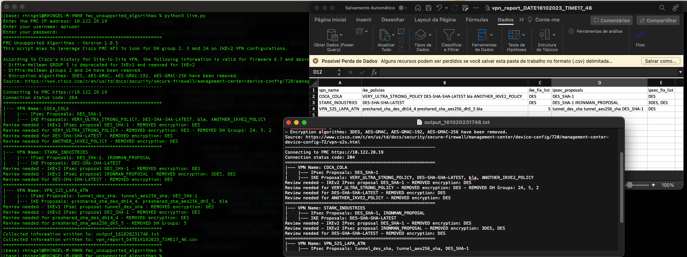

# FMC_Unsupported_Algorithms - Update 1.0.5!
[](https://developer.cisco.com/codeexchange/github/repo/RenanHingel/fmc_unsupported_algorithms)[](https://developer.cisco.com/devenv/?id=devenv-vscode-base&GITHUB_SOURCE_REPO=https://github.com/RenanHingel/fmc_unsupported_algorithms)

## The motivator:
To elevate the security standards, Cisco updated the acceptable algorithms that may be used to build VPN tunnels starting from firmware 6.7 and superior versions.

    You may not be able to upgrade an FMC, or deploy post-upgrade with FDM, if you use any of the following FTD features:

    Diffie-Hellman groups: 2, 5, and 24.
    Group 5 continues to be supported in FMC deployments for IKEv1, but we recommend you change to a stronger option.
    Encryption algorithms for users who satisfy export controls for strong encryption: DES, 3DES, AES-GMAC, AES-GMAC-192, AES-GMAC-256. DES continues to be supported (and is the only option) for users who do not satisfy export controls.
    The NULL "encryption algorithm" (authentication without encryption, for testing purposes) continues to be supported in FMC deployments for both IKEv1 and IKEv2 IPsec proposals. However, it is no longer supported in IKEv2 policies.
    Hash algorithms: MD5.

    If you are still using these features in IKE proposals or IPsec policies, change and verify your VPN configuration before you upgrade. 
    
Source: [https://www.cisco.com/c/en/us/support/docs/security-vpn/ipsec-negotiation-ike-protocols/216276-configure-route-based-site-to-site-vpn-t.html](https://www.cisco.com/c/en/us/td/docs/security/firepower/670/relnotes/firepower-release-notes-670/m_features_functionality.html?bookSearch=true)

If you have just a few VPNs configured, determining which VPNs must be modified is an easy task. 
However, if you need to generate a structured report and contact dozens (and sometimes hundreds) of VPN peers to inform them about the need to update their end, this task can consume hundreds of hours and examining the configurations manually is prone to human error.

The managed devices still running with these deprecated settings are unable to be upgraded past firmware 6.6.X, this poses a stability and security threat to your network environment.

## A proposed solution:
Use the Cisco Secure Firewall Management Center (FMC) API to leverage the information about VPNs, automatically parse the unsecure configurations and create a log file with completed run details and a clean CSV file containing just the important information.



## Understanding the script logic (UML):

          +-----------------------------------------------------+
          |              Start Program                          |
          +-----------------------------------------------------+
                V
          +-----------------------------------------------------+
          |  Generate FMC token                                 |
          |  /api/fmc_platform/v1/auth/generatetoken            |
          +-----------------------------------------------------+
                V
          +-----------------------------------------------------+
          |  Get a full list of all IKEv1 IPSEC Proposals       |
          |  /api/fmc_config/v1/domain/{domainUUID}/object/     |
          |  ikev1ipsecproposals?offset=0&limit=4&expanded=true |
          +-----------------------------------------------------+
                V
          +-----------------------------------------------------+
          |  Get a full list of all IKEv2 IPSEC Proposals       |
          |  /api/fmc_config/v1/domain/{domainUUID}/object/     |
          |  ikev2ipsecproposals?offset=0&limit=10&expanded=true|
          +-----------------------------------------------------+
                V
          +-----------------------------------------------------+
          |  Get a full list of all IKEv1 IKE Policies          |
          |  /api/fmc_config/v1/domain/{domainUUID}/object/     |
          |  ikev1policies?offset=0&limit=10&expanded=true      |
          +-----------------------------------------------------+
                V
          +-----------------------------------------------------+
          |  Get a full list of all IKEv2 IKE Policies          |
          |  /api/fmc_config/v1/domain/{domainUUID}/object/     |
          |  ikev2policies?offset=0&limit=10&expanded=true      |
          +-----------------------------------------------------+
                V
          +-----------------------------------------------------+
          |  Loop (For Each IKEv1 and IKEv2 IKE Policy)         |
          |                                                     |
          |    +-----------------------------------------------------------+
          |    |  Launch GET Request to Obtain IKE Settings                |
          |    |  /api/fmc_config/v1/domain/{domainUUID}/policy/           |
          |    |  ftds2svpns/{objectId}/ikesettings/{ike_settings_id}      |
          |    +-----------------------------------------------------------+
          |                                                     |
          +-----------------------------------------------------+
                V
          +-----------------------------------------------------+
          |  Loop (For Each VPN)                                |
          |                                                     |
          |    +-----------------------------------------------------------+
          |    |  Launch GET Request to Obtain VPN Details                 |
          |    |  /api/fmc_config/v1/domain/{domainUUID}/policy/           |
          |    |  ftds2svpns/{vpn_id}/ikesettings/{ike_settings_id}        |
          |    +-----------------------------------------------------------+
          |                                                     |
          +-----------------------------------------------------+
                V
          +-----------------------------------------------------+
          |  End Program                                        |
          +-----------------------------------------------------+


## Solution Components
* Cisco FMC API
* Python

## Installation:

### Console
#### Clone the repo
```console
git clone https://github.com/RenanHingel/fmc_unsupported_algorithms.git
```

### Python

#### Set up a Python venv
First make sure that you have Python 3 installed on your machine. We will then be using venv to create
an isolated environment with only the necessary packages.

##### Install virtualenv via pip
```
pip install virtualenv
```

##### Create a new venv
```
# Change to your project folder
cd fmc_unsupported_algorithms

# Create the venv
virtualenv venv

# Activate your venv
source venv/bin/activate
```

#### Install dependencies
```zsh
pip3 install -r requirements.txt
```

#### Run the script
```
python3 get_vpn_requirements.py
```

## Contacts
* Renan Hingel (renanhingel@gmail.com)
